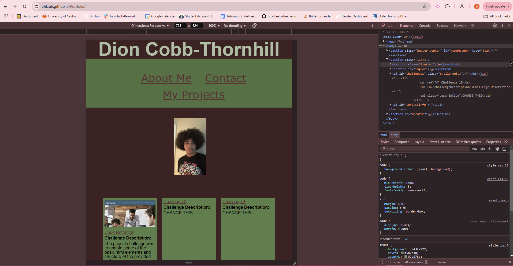

# Portfolio

Module 2 challenge

## Description
For this assignment the task was to use advanced css to create a responsive portfolio to hold our work throughout the program. By using the css styling tools we have learned in combination with the `@media screen and (max-width: )` tool the website was made responsive and design skills were thoroughly utilized.

## Difficulties

### Centering
During this assignment there was trouble with centering things on the page consistently among all elements. Through a resource found online the issue was easily resolved by creating a `center` class.

### Challenge Boxes
When creating the challenge boxes there was difficulty getting the content to fit inside as well as getting the boxes to be a uniformed size. Through a turoring session with Andres the issues were quickly resolved.

## Resources Utilized

>* [Used to create CSS variables](https://www.w3schools.com/css/css3_variables.asp)
>* [Used for center class](https://www.w3schools.com/howto/howto_css_image_center.asp)

## Screenshot

## Deployment Link

[https://ohkrah.github.io/Portfolio/](https://ohkrah.github.io/Portfolio/)